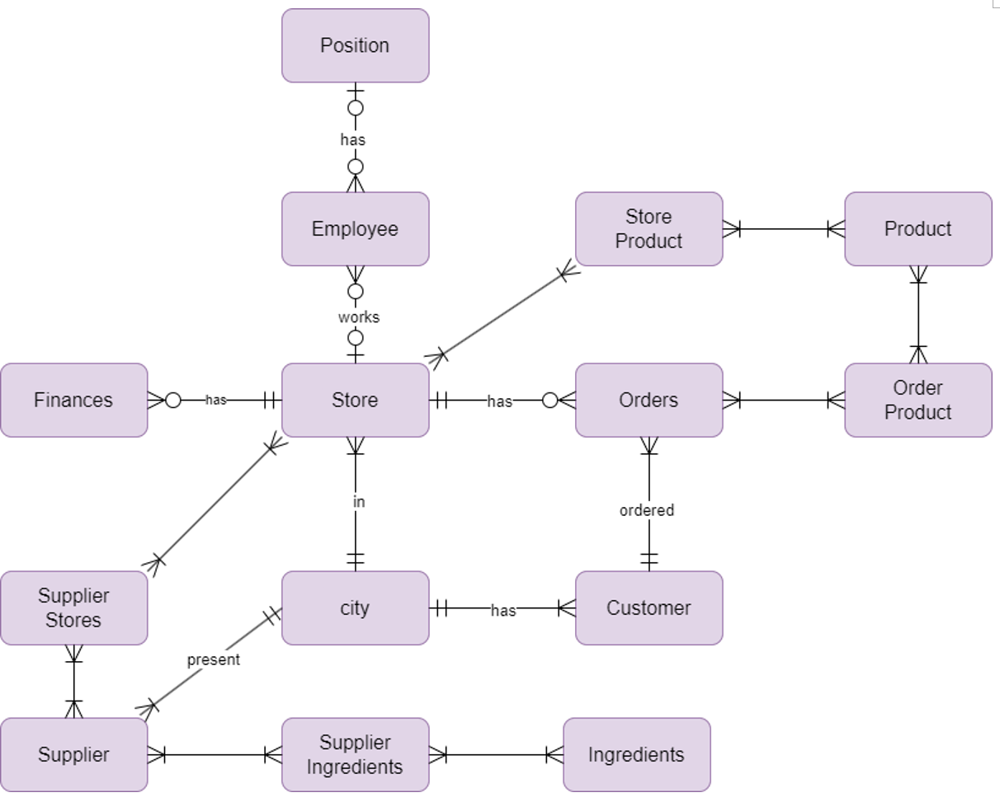

# Design Document

By M M Kaverappa

Video overview: <https://youtu.be/j2LerhreSDc>

## Scope

The database for *CS50 SQL Final Project* includes all entities necessary to facilitate the database for a *Cafe* which
has multiple locations in different cities. As such, included in the database's scope is:

- **Stores**, includes basic information
- **Employees**, basic information + position, salary, starting date, id of the store which they are working
- **City**, name and the state in which the city is located
- **Position**, the job position in the cafe
- **Finances**, store id, revenue and expenses
- **Customers**, basic information, total amount saved due to discounts, membership details and city id
- **Orders**, customer id, id of the store in which the order is placed, the amount, date and type of order
- **Products**, information about name of the product and the category
- **Order_Products**, table relating Orders and Products
- **Product_Store**, table showing which products are present in which stores
- **Supplier**, basic information about the supplier like name and city id
- **Ingredients**, the name of the ingredients, and type
- **Supplier_ingredients**, table relating supplier and ingredients

Out of scope elements are
- Details about the orders placed through an app
- Further details about employee management such as who is responsible of a group of employees etc.
- No details about the management of the store such as its condition and whether its in renovation etc.
- No method to detemine where future stores can be built.
- Customers cannot change their address or their city location

Many of these out of scope elements could not be added to this project due to limitations on the size and the complexity of this project to be done by one student

## Functional Requirements

This database will support:
- CRUD operations on orders done.
- Information about the employees as well as the revenue generated for each store.
- Products sold in a store and the supplier responsible for the ingredients for that store

## Representation

Entities are represented in SQLite tables with the following schema.

### Entities

The database includes the following entities

#### Cities

The `cities` table includes:
- `id` which specifies the unique ID for the city as `INTEGER`. This column has the `PRIMARY KEY` constraint applied. It will be incremented by `AUTOINCREMENT`.
- `name` which specifies the city name as `TEXT`.
- `state` which specifies which state the city is located in as `TEXT`.

All columns in the `cities` table are required hence the `NOT NULL` constraint in applied.

#### Suppliers

The `suppliers` table includes:
- `id` which specifies the unique ID for the supplier as `INTEGER`. This column has the `PRIMARY KEY` constraint applied. It will be incremented by `AUTOINCREMENT`.
- `supplier_name` which specified the name of the supplier company in `TEXT`.
- `address` which specifies the address of the company in `TEXT`.
- `city_id` which contains the ID of the city in which the company is located. The constraint `FOREIGN KEY` is applied as it requires the city id from the `cities` table.
- `phone_no` which specifies the phone number of the company, reprsented in `TEXT`, it has `UNIQUE` constaint as two phone numbers cannot be the same.

All columns in the `suppliers` table are required hence the `NOT NULL` constraint is applied.

#### Ingredients

The `ingredients` table includes:
- `id` which specifies the unique ID of the ingredient as `INTEGER`. This column has the `PRIMARY KEY` constraint applied. It will be incremented by `AUTOINCREMENT`.
- `name` which specifies the name of the ingredient which needs to be supplied to the store. It is represented by `TEXT`.

All columns in the `ingredients` table are required hence the `NOT NULL` constraint is applied.

#### Supplier Ingredients

The `supplier_ingredients` table includes:
- `supplier_id` which specifies the ID of the company which will supply the necessary ingredients to the store. It is represented in `INTEGER`.
- `ingredient_id` which specifies the ID of the ingredient which needs to be supplied to the store in `INTEGER`.

All columns in the `supplier_ingredients` table are required hence the `NOT NULL` constraint is applied and all columns also have the `FOREIGN KEY` constraint applied as they refer to another table.

#### Stores

The `stores` table includes:
- `id` which specifies the unique ID of the store as `INTEGER`. This column has the `PRIMARY KEY` constraint applied. It will be incremented by `AUTOINCREMENT`.
- `address` which specifies the address of the store in `TEXT`. A `UNIQUE` constraint is applied as two stores cannot be in the same location
- `email` which contains the email of the store in `TEXT`. An email should be `UNIQUE` as it cannot be repeated. The should should have an **@** symbol in it and so a `CHECK` constraint is applied to check an email follows `%@%` format.
- `phone_no` which specifies the phone number of the store, reprsented in `TEXT`, it has `UNIQUE` constaint as two phone numbers cannot be the same.
- `city_id` which specifies the ID of the city in which the store is located in `INTEGER`.
- `total_employees` which specifies the number of employees which work in that store as `INTEGER`. A recently opened store can have zero employees so a `NOT NULL` constraint is not applied and the default value is 0.
- `opening_date` which specifies in `TEXT` the date on which the store was first opened. It is represented in the ISO format YYYY-MM-DD.

All columns in the `stores` table except `total_employees` are required hence the `NOT NULL` constraint is applied. The column `city_id` has a `FOREIGN KEY` constraint as it refers to `cities` table and the column `supplier_id` has a `FOREIGN KEY` constraint as it refers to the `suppliers` table.

#### Supplier Stores

The `supplier_stores` table includes:
- `supplier_id` which specifies the ID of the supplier who is supplying the store as `INTEGER`.
- `store_id` which specifies the ID of the store to which the supplies are begin sent to as `INTEGER`.

All columns in the `supplier_stores` table are required hence the `NOT NULL` constraint is applied. The columns `supplier_id` has a `FOREIGN KEY` constraint as it refers to `id` column of the `suppliers` table. Another `FOREIGN KEY` constraint is applied to `store_id` as it refers to the `id` columns of the `stores` table.

#### Products

The `products` table includes:
- `id` which specifies the unique ID of the product as `INTEGER`. This column has the `PRIMARY KEY` constraint applied. It will be incremented by `AUTOINCREMENT`.
- `product_name` which specifies in `TEXT` the name of the product which is begin sold in the stores.
- `price` which specifies the price the product is being sold at. It is represente in `NUMERIC` as the price may have decimals.
- `category` which specifies the category in which product may be grouped into. It is shown in `TEXT`.

All columns in the `products` table are required hence the `NOT NULL` constraint is applied.

#### Product Stores

The `product_stores` table includes:
- `store_id` which specifies the ID of the store in which the product is begin sold at. It is represented in `INTEGER`. It has a `FOREIGN KEY` constraint applied as it refers to the `id` column of the `stores` table.
- `product_id` which specifies the ID of the product which is begin sold. It is represented in `INTEGER`. It has a `FOREIGN KEY` constraint applied as it refers to the `id` column of the `products` table.

All columns in the `product_stores` table are required hence the `NOT NULL` constraint is applied.

#### Positions

The `positions` table includes:
- `id` which specifies the unique ID of the position as `INTEGER`. This column has the `PRIMARY KEY` constraint applied. It will be incremented by `AUTOINCREMENT`.
- `position` which specifies in `TEXT` the types of position which is available for an employee.

All columns in the `positions` table are required hence the `NOT NULL` constraint is applied.

#### Employees

The `employees` table includes:
- `id` which specifies the unique ID of the employee as `INTEGER`. This column has the `PRIMARY KEY` constraint applied. It will be incremented by `AUTOINCREMENT`.
- `first_name` which specifies the first name of the employee who is working for the Store Chain. It is represented by `TEXT` and it should not be `NULL`.
- `last_name` which specifies the last name of the employee in `TEXT`. In consideration that many people do not have a last name the constraint `NOT NULL` is not applied.
- `dob` which specifies the date of birth of the employee in `TEXT`. It follows the ISO format of YYYY-MM-DD. The `NOT NULL` constraint is not applied as many do not remember their date of birth as there were not proper documentation until recently.
- `gender` which specifies the gender of the employee in `TEXT`. The constraint `NOT NULL` is applied.
- `email` which contains the email of the employee in `TEXT`. An email should be `UNIQUE` as it cannot be repeated. The should should have an **@** symbol in it and so a `CHECK` constraint is applied to check an email follows `%@%` format.
- `phone_no` which specifies the phone number of the employee, reprsented in `TEXT`, it has `UNIQUE` constaint as two phone numbers cannot be the same.
- `address` which specifies the address of the employe in `TEXT`. An employee must have an address so a `NOT NULL` constraint it applied.
- `salary` specifies the salary of the employee in `NUMERIC`. The salary is in per annum and cannot be null so a `NOT NULL` constraint is applied.
- `working_store_id` specifies the ID of the store in which the employee is working at in `INTEGER`. An employee can be recently hired and not be assigned any store yet, hence the `NOT NULL` constraint is not applied.
- `position_id` which specifies the ID of the position which the employee currently has in `INTEGER`. A recently hired employee may not have been assigned a position yet, hence the `NOT NULL` constraint is not applied.
- `hired_date` which specifies the date on which the employee was first hired in `TEXT` it follows the ISO format of YYYY--MM--DD. The date cannot be null so a `NOT NULL` constraint is applied.

A `FOREIGN KEY` constraint is applied to the `working_store_id` column as it refers to the `id` column of `stores` table. Similarly another `FOREIGN KEY` constraint is applied to the `position_id` column as it refers to the `id` columns of `positions` table.

#### Finances

The `finances` table includes:
- `id` which specifies the unique ID of the financial row as `INTEGER`. This column has the `PRIMARY KEY` constraint applied. It will be incremented by `AUTOINCREMENT`.
- `store_id` which specifies the ID of the store for which the financial date is present in `INTEGER`.
- `yearly_revenue` which specifies in `NUMERIC` the total yearly revenue which the store makes.
- `yearly_expenses` which specifies in `NUMERIC` the total yearly expenses which the store loses.
- `year` which specifies the year for which the date is present in `INTEGER`.

All columns in the `finances` table are required hence the `NOT NULL` constraint is applied. A `FOREIGN KEY` constraint is applied to the `store_id` column as it refers to the `id` column in the `stores` table.

#### Customers

The `customers` table includes:
- `id` which specifies the unique ID of the customer row as `INTEGER`. This column has the `PRIMARY KEY` constraint applied. It will be incremented by `AUTOINCREMENT`.
- `first_name` which specifies the first name of the customer. It is represented by `TEXT` and it should not be `NULL`.
- `last_name` which specifies the last name of the customer in `TEXT`. In consideration that many people do not have a last name the constraint `NOT NULL` is not applied.
- `gender` which specifies the gender of the customer in `TEXT`. It has a `NOT NULL` constraint applied.
- `address` which specifies the address of the customer in `TEXT`. As addresses are only necessary if the customer orders a delivery to them a `NOT NULL` constraint is not required.
- `email` which contains the email of the customer in `TEXT`. An email should be `UNIQUE` as it cannot be repeated. The should should have an **@** symbol in it and so a `CHECK` constraint is applied to check an email follows `%@%` format. A `NOT NULL` constraint is applied as it required for the member benefits
- `phone_no` which specifies the phone number of the customer, reprsented in `TEXT`, it has `UNIQUE` constaint as two phone numbers cannot be the same.
- `saved_amount` which specifies the total amount which the customer has saved by purchasing from the store. It is represented in `NUMERIC` and has a default value of 0.0
- `membership` which specifies if a customer has a membership in `TEXT`, it has a default value as `N` as a `CHECK` constraint to check if it is in `Y` or `N`.

#### Orders

The `orders` table includes:
- `id` which specifies the unique ID of the order as `INTEGER`. This column has the `PRIMARY KEY` constraint applied. It will be incremented by `AUTOINCREMENT`.
- `store_id` which specifies the ID of the store in which the order was placed as `INTEGER`.
- `customer_id` which specifies the ID of the customer who ordered an item as `INTEGER`.
- `amount` which specifies the amount of the order which was placed as a `NUMERIC`.
- `datetime` which specifies the time and date on which the order was placed as `TEXT`. It follows the ISO format of YYYY-MM-YY HH:MM:SS and the default value is set as `CURRENT_TIMESTAMP`.
- `order_type` which specifies the type of order placed, it has a `CHECK` constraint which check if the order_type is in `Dine-In, Takeaway or Delivery`. The default value is set as `Dine-In`.

All the columns in the `orders` table are required hence the `NOT NULL` constraint is applied. A `FOREIGN KEY` constraint is applied to the `store_id` column as it refers to the `id` column in the `stores` table. Similarly another `FOREIGN KEY` constraint is applied to the `customer_id` column as it refers to the `id` column in the `customers` table.

#### Ordered Products

The `ordered_products` table includes:
- `order_id` which specifies the ID of the orders as `INTEGER`. It has a `FOREIGN KEY` constraint as it refers to the `id` column in the `orders` table.
- `product_id` which specifies the ID of the product which was ordered as `INTEGER`. It has a `FOREIGN KEY` constraint as it refers to the `id` column in the `products` table.
- `quantity` which specifies the number of products which was placed in that order as `INTEGER`.

All the columns in the `ordered_products` table are required hence the `NOT NULL` constraint is applied.

### Relationships

The below entity relationship diagram describes the relationships among the entities in the database.

As detailed by the diagram:

- A store can have zero to many employees, zero if the store is recently opened and many if the store is running for a while. An employee can work for zero to one store, zero if the employee has been recently hired.
- An employee can have zero to one position, zero if the employee is recently hired and one if the employee has been successfully alloted an position. A position can have zero to many employees, zero if there is no one qualified or if any employee retired and many if the position is a common one.
- A store can be located in one and only one city, and one city can have one to many stores.
- A store can have zero to many financial data, zero if the store is newly opened and there is no data nad many if the store has been running for some years. A financial data can be related to one and only one store at a time.
- A supplier can supply to one to many stores, and a store can be supplied from one to many suppliers.
- A supplier can be present in one and only one city, and a city can have one to many suppliers.
- A supplier can supply one to many ingredients and one material can be supplied by one to many ingredients.
- A customer can be located in one and only one city, and a city can have one to many customers.
- A store can have zero to many orders and an order can be made from one and only one store.
- A customer can have one to many orders and an order can have one and only one customer.
- An order can contain one to many products, and a product can have one to many orders
- A store can have one to many products, and a product can be sold in one to many stores.

## Optimizations

**Indexing**

- `employee_search` to get faster results on user queries, as a lot of them requires the names and id's of the employees who are working, this includes `first_name`, `last_name`, `working_store_id` and `store_id`.
- `supplier_search` to get quicker results on the `supplier_name` and `city_id` of the supplier so that the user can use them efficiently.
- `store_search` to seach for stores more effectively and the centre of this dataset is the store and all are related to in some way. It contains `id`, `address`, `city_id`.
- `finances_search` is related in speeding up the queries for the store and year data with `store_id` and `year`
- `financial_data` makes the user queries for financial data quicker. It has indexes for `yearly_revenue` and `yearly_expenses`
- `customer_search` is the essence to a successful business so the queries to this table is very important and has indexes for `id`, `first_name` ,`last_name`.
 `op_search` to speed up queries relating to finding the ordered products which contains `order_id` and `product_id`.

 **Views**

 - `employee_work` to view the information relating to the employee names, address and position.
 - `customer_orders` to view the information relating the customer names, the number of products which they have ordered and if they have a membership
 - `supplier_cities` to view the cities in which the suppliers are present, their addresses and their phone numbers

**Triggers**

- `invalid_employee_position` Checks if the entered employee position is valid
- `invalid_employee_hired_date` checks if the entered employees hired date is valid
- `invalid_supplier_cityid` checks if the supplier city id is valid
- `invalid_supplier_id` checks if the entered supplier_id is valid
- `invalid_ingredient_id` checkss if the ingredient id is valid
- `invalid_store_cityid` checks if the entered store city_id is valid

## Limitations

- No order history, hence order pattern cannot be analyzed
- Financial data is in yearly basis so the quaterly data cannot be analyzed
- No tracking of promotion and leaves of employees
- No hashing of emails and phone numbers
- No audit logs to check if someone has changed some information
